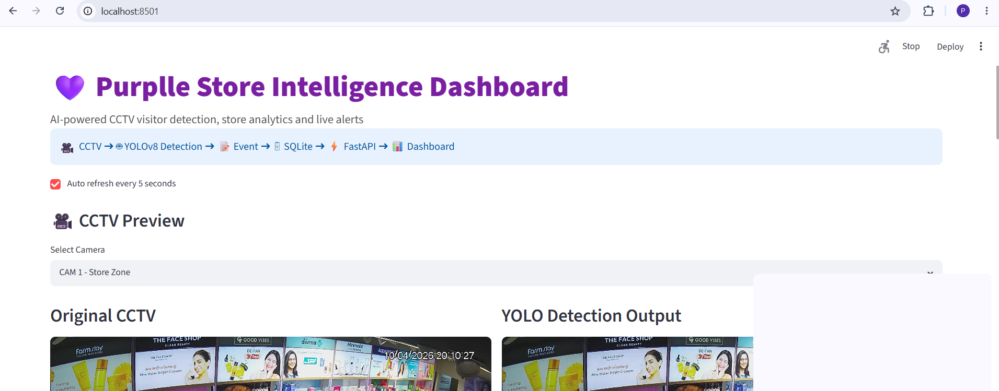
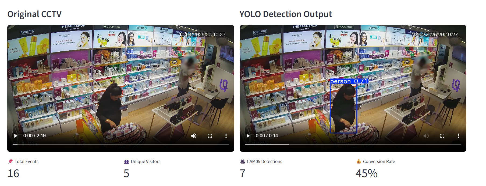
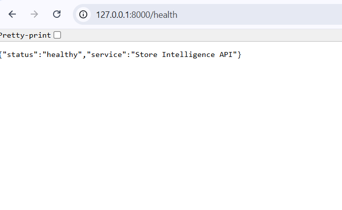
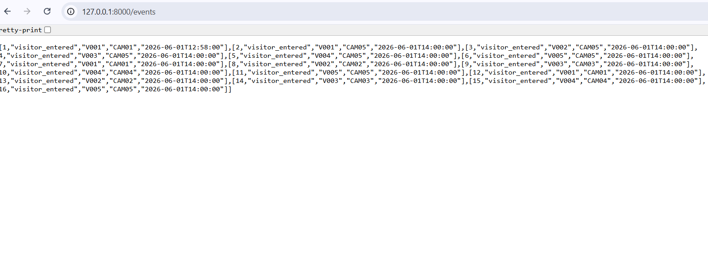
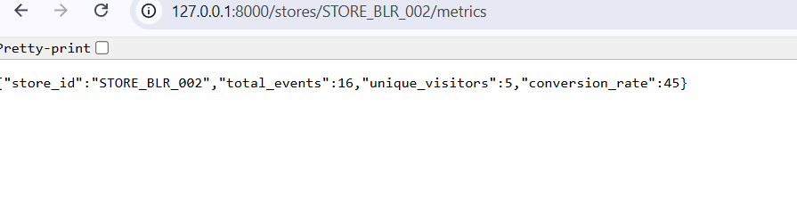
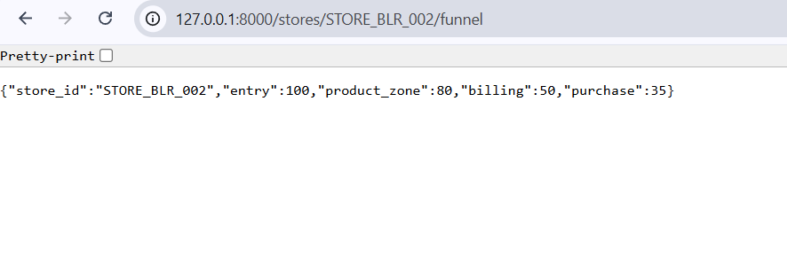
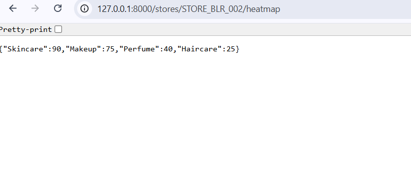
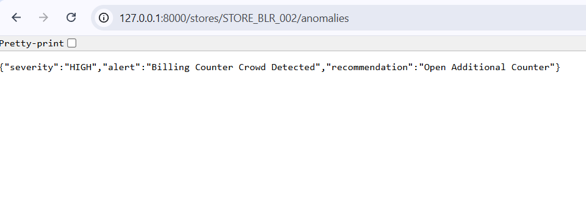

# Purplle Store Intelligence Dashboard

AI-powered retail store intelligence platform built for the Purplle Tech Challenge 2026.

The system processes CCTV video feeds, detects visitors using YOLOv8, stores events in SQLite, exposes analytics through FastAPI APIs, and visualizes store insights through an interactive Streamlit dashboard.

## Features

* YOLOv8-based visitor detection
* Multi-camera CCTV monitoring (5 Cameras)
* Original CCTV and YOLO detection preview
* FastAPI backend services
* SQLite event database
* Real-time visitor event tracking
* Visitor metrics analytics
* Conversion funnel analysis
* Store heatmap analytics
* Crowd anomaly detection
* Interactive Streamlit dashboard
* CSV report export
* Automated test suite (Pytest)

## Tech Stack

* Python
* YOLOv8 (Ultralytics)
* OpenCV
* FastAPI
* SQLite
* Streamlit
* Pandas
* SQLAlchemy
* Pytest

## Project Structure

```text
PURPLLE_HACKATHON/
├── app/
│   ├── main.py
│   ├── database.py
│   └── models.py
├── dashboard/
│   └── app.py
├── pipeline/
│   └── pipeline/
│       ├── detect.py
│       └── convert_video.py
├── data/
├── docs/
│   ├── DESIGN.md
│   └── CHOICES.md
├── tests/
├── requirements.txt
├── Dockerfile
├── docker-compose.yml
└── README.md
```

## Installation

```bash
pip install -r requirements.txt
```

## Run FastAPI

```bash
uvicorn app.main:app --reload
```

## Run Dashboard

```bash
streamlit run dashboard/app.py
```

## API Endpoints

* `/health`
* `/events`
* `/stores/STORE_BLR_002/metrics`
* `/stores/STORE_BLR_002/funnel`
* `/stores/STORE_BLR_002/heatmap`
* `/stores/STORE_BLR_002/anomalies`

## Testing

```bash
pytest
```

Result:

```text
3 passed
```

## Screenshots

### Dashboard


### YOLO Detection


### Health API


### Events API


### Metrics API


### Funnel API


### Heatmap API


### Anomalies API
