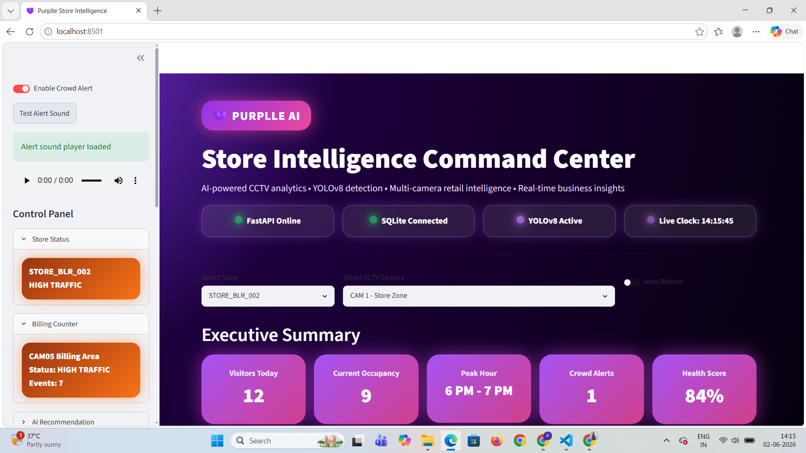
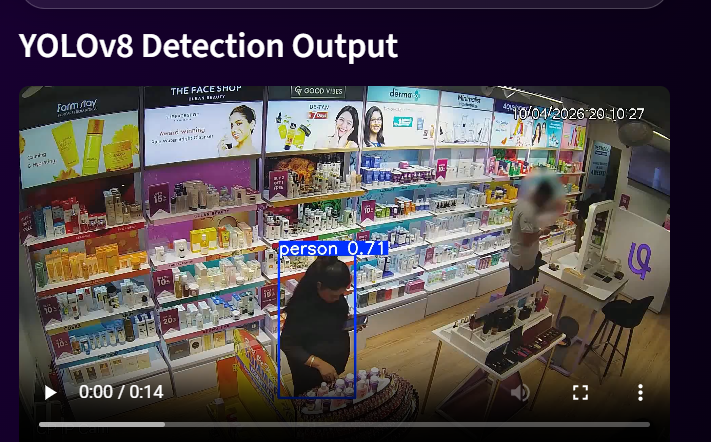
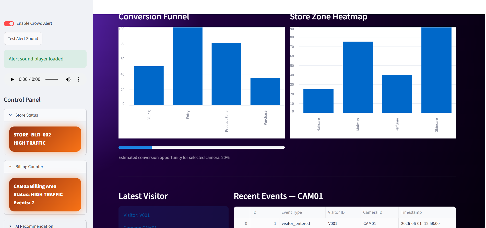
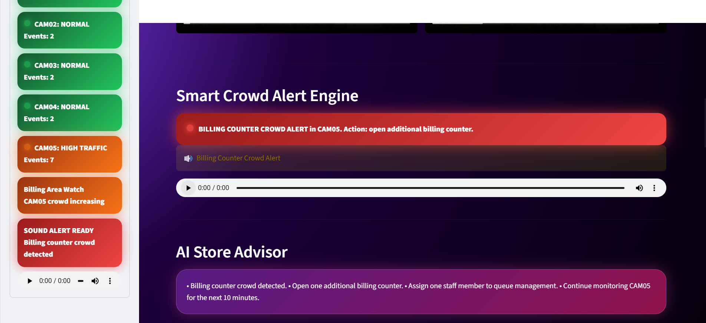

# 💜 Purplle Store Intelligence Dashboard
## 🚀 Live Demo

🔗 Streamlit Dashboard:
https://purplle-store-intelligence-dashboard.streamlit.app

🔗 GitHub Repository:
https://github.com/Pavi54711/purplle-store-intelligence-dashboard

### AI-Powered Retail Analytics & Store Intelligence Platform

Built for the **Purplle Tech Challenge 2026**, this project converts CCTV footage into real-time retail intelligence.

The platform uses **YOLOv8**, **FastAPI**, **SQLite**, and **Streamlit** to monitor customer activity, detect crowd build-up, analyze store zones, and provide operational recommendations for store managers.

---

## 🎯 Problem Statement

Retail stores generate CCTV footage every day, but most of that footage is only used for security review.

Store managers need a smarter way to understand:

- How many customers are entering different zones
- Which camera/zone has high activity
- Whether the billing counter is getting crowded
- Where customer engagement is high or low
- What action should be taken during peak traffic

This solution transforms CCTV videos into a live AI-powered store intelligence dashboard.

---

## 🏗 Solution Architecture

```text
┌──────────────────────┐
│   CCTV Video Feeds   │
│ CAM01 - Store Zone   │
│ CAM02 - Product Zone │
│ CAM03 - Entry/Exit   │
│ CAM04 - Staff Area   │
│ CAM05 - Billing Area │
└──────────┬───────────┘
           │
           ▼
┌──────────────────────┐
│   YOLOv8 Detection   │
│ Visitor Identification│
│ Object Detection     │
│ Detection Output     │
└──────────┬───────────┘
           │
           ▼
┌──────────────────────┐
│   FastAPI Backend    │
│ Events API           │
│ Metrics API          │
│ Funnel API           │
│ Heatmap API          │
│ Anomaly API          │
└──────────┬───────────┘
           │
           ▼
┌──────────────────────┐
│   SQLite Database    │
│ Visitor Events       │
│ Camera Activity      │
│ Timestamped Records  │
└──────────┬───────────┘
           │
           ▼
┌──────────────────────┐
│ Streamlit Dashboard  │
│ Live Camera View     │
│ Smart Alerts         │
│ Business Insights    │
│ CSV Reports          │
└──────────────────────┘
```

---

## 🚀 Key Features

### 🤖 AI Computer Vision

- YOLOv8-based visitor detection
- Original CCTV video preview
- YOLO detection output preview
- Multi-camera monitoring
- Camera-wise customer activity tracking

### 📊 Retail Intelligence

- Executive KPI dashboard
- Visitor count analytics
- Camera-wise event distribution
- Store activity comparison
- Conversion funnel analytics
- Store zone heatmap analytics
- Current occupancy estimation
- Store health score

### 🚨 Smart Alert System

- Crowd monitoring
- High traffic detection
- Billing counter crowd alert
- Alert enable/disable option
- Alert sound test option
- AI-based operational recommendation

### 💡 Business Insights

- Most active camera detection
- Zone-wise activity analysis
- Conversion opportunity estimation
- Peak hour analytics
- Recommended action for store staff
- Downloadable analytics report

---

## 🛠 Technology Stack

| Layer | Technology |
|---|---|
| Computer Vision | YOLOv8 / Ultralytics |
| Video Processing | OpenCV |
| Backend | FastAPI |
| Database | SQLite |
| Dashboard | Streamlit |
| Data Processing | Pandas |
| Testing | Pytest |
| Deployment Support | Docker |

---

## 📂 Project Structure

```text
PURPLLE_HACKATHON/
├── app/
│   ├── main.py
│   ├── database.py
│   └── models.py
│
├── dashboard/
│   └── app.py
│
├── pipeline/
│   └── pipeline/
│       ├── detect.py
│       └── convert_video.py
│
├── data/
├── docs/
│   ├── DESIGN.md
│   └── CHOICES.md
│
├── tests/
│   ├── screenshots/
│   ├── test_events.py
│   ├── test_health.py
│   └── test_metrics.py
│
├── requirements.txt
├── Dockerfile
├── docker-compose.yml
└── README.md
```

---

## ⚙️ Installation & Run

### 1. Install Dependencies

```bash
pip install -r requirements.txt
```

### 2. Start FastAPI Backend

```bash
uvicorn app.main:app --reload
```

FastAPI will run at:

```text
http://127.0.0.1:8000
```

### 3. Start Streamlit Dashboard

```bash
streamlit run dashboard/app.py
```

Dashboard will run at:

```text
http://localhost:8501
```

---

## 🔌 API Endpoints

| Endpoint | Description |
|---|---|
| `/health` | Checks backend service health |
| `/events` | Returns visitor detection events |
| `/stores/STORE_BLR_002/metrics` | Returns store-level metrics |
| `/stores/STORE_BLR_002/funnel` | Returns conversion funnel analytics |
| `/stores/STORE_BLR_002/heatmap` | Returns zone-wise heatmap analytics |
| `/stores/STORE_BLR_002/anomalies` | Returns crowd anomaly alerts |

---

## ✅ Testing

```bash
pytest
```

Test result:

```text
3 passed
```

---

# 📸 Dashboard Screenshots

## 🎯 Executive Dashboard



The executive dashboard gives a real-time overview of store operations.

It includes:

- FastAPI service status
- SQLite database status
- YOLOv8 engine status
- Live clock
- Store selector
- Camera selector
- Visitor metrics
- Store health score
- Current occupancy
- Crowd alert count

---

## 🎥 Live Camera Intelligence + YOLO View


This section shows the original CCTV feed and the YOLOv8 detection output side by side.

It helps store managers compare:

- Raw CCTV footage
- AI detection output
- Visitor movement
- Camera-wise activity
- Zone-specific monitoring

---

## 🤖 YOLOv8 Detection Output



YOLOv8 is used to detect visitors and objects from the CCTV footage.

This demonstrates:

- Person detection
- Object detection
- Bounding box visualization
- AI-powered video analytics
- Detection output generation

---

## 🔥 Heatmap Analytics



The heatmap section shows activity across store zones.

It helps identify:

- High-engagement zones
- Low-engagement zones
- Customer movement patterns
- Store layout optimization opportunities
- Zone-wise business insights

---

## 🚨 Smart Alert System



The smart alert system monitors crowd activity and highlights high-traffic areas.

It includes:

- Billing counter crowd alert
- High traffic warning
- Camera-wise live alerts
- Alert enable/disable control
- Alert sound test option
- AI recommendation for store staff

---

## 💼 Business Impact

This solution helps store teams to:

- Detect crowd build-up early
- Reduce billing congestion
- Improve staff allocation
- Track visitor movement
- Understand active zones
- Improve conversion opportunities
- Make data-driven store decisions

---

## 🧪 Why This Project Is Useful

Traditional CCTV systems only record video.

This project adds intelligence on top of CCTV by converting video into:

- Visitor events
- Camera-wise metrics
- Store heatmap
- Crowd alerts
- Business insights
- Actionable recommendations

---

## 👩‍💻 Developed By

**Pavithra Rajan**

Built for **Purplle Tech Challenge 2026**

**YOLOv8 • FastAPI • SQLite • Streamlit • OpenCV**